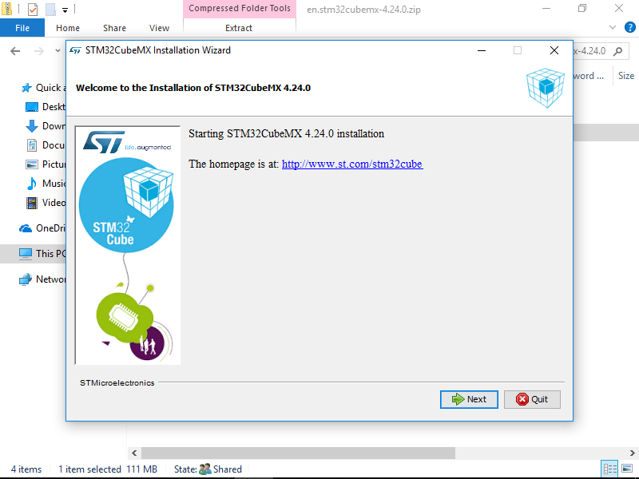
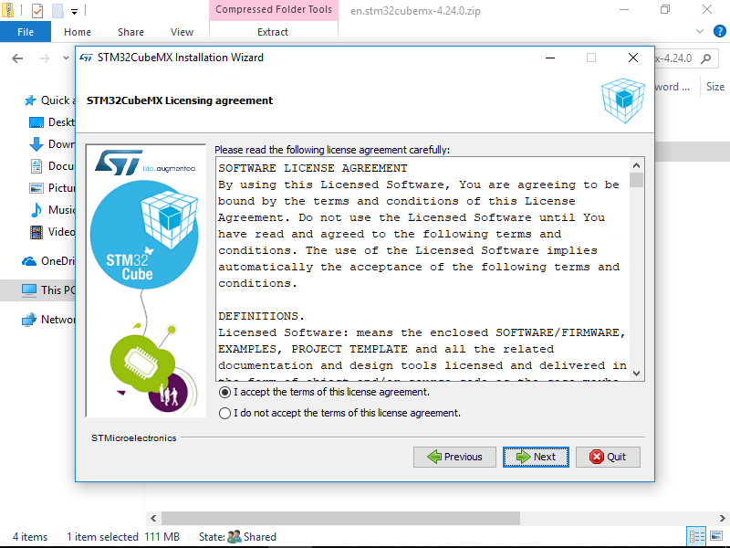
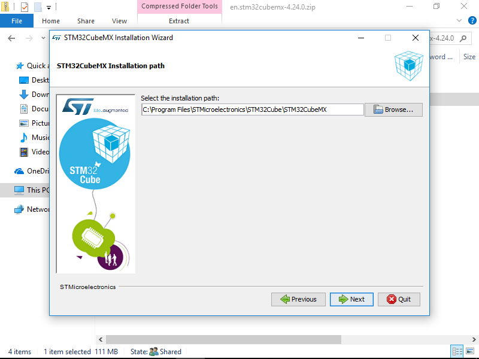
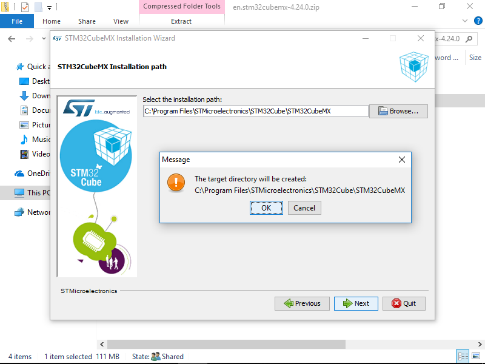
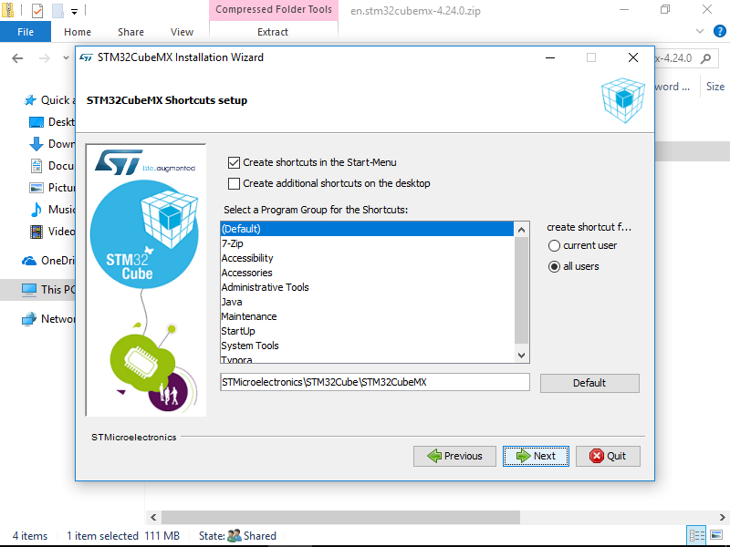
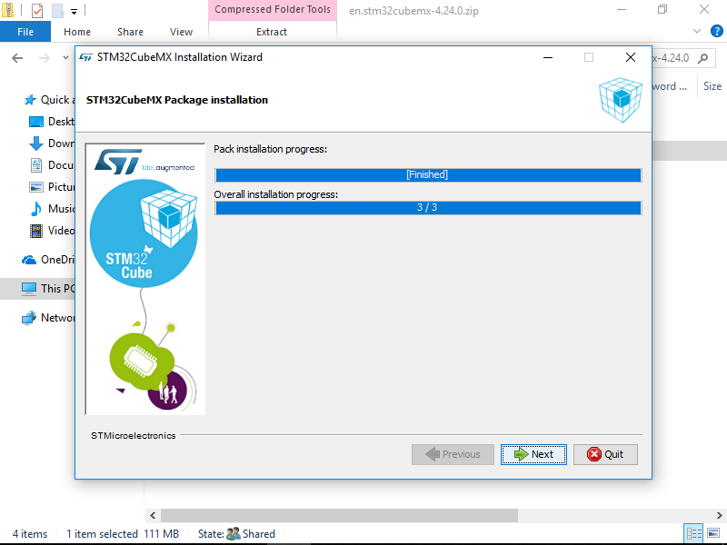
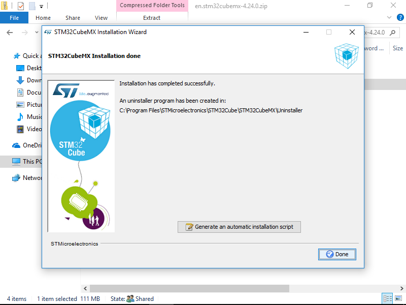
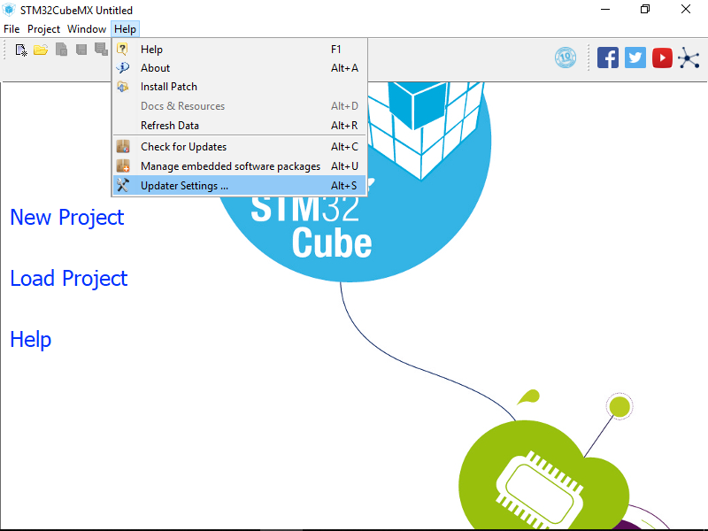
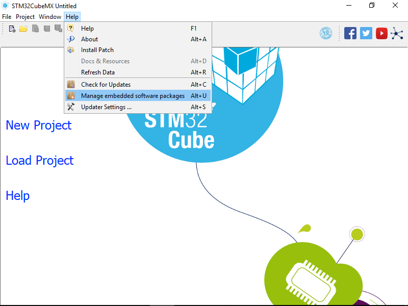
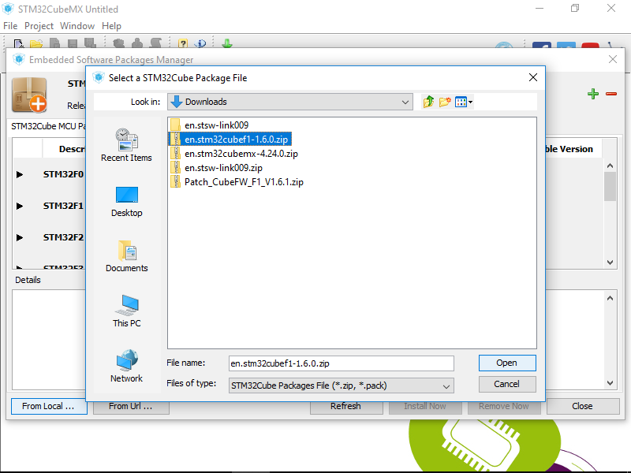

# STM32CubeMX

本节介绍 STM32CubeMX 的安装。STM32CubeMX 是生成STM32初始化代码的工具，能以图形界面的方式配置STM32所需资源，简化初始化代码的编写。其能够导出适用于多种开发环境的工程文件。

STM32CubeMX可以在Windows、Linux 以及 Mac OS 上运行，但本文只针对 Windows 上的安装与使用进行配置。

# 安装方法

所需文件：
- `en.stm32cubemx.zip`
- `en.stm32cubef1.zip`
- JRE

STM32CubeMX 使用 Java 编写，其正确运行需要 JRE，如果电脑上没有安装 JRE，可以于 [Java SE](http://www.oracle.com/technetwork/java/javase/downloads/index.html) 下载安装 JRE

其中 `en.stm32cubemx.zip` 文件为 Cube 的安装包，参照其中 `Readme.html` 完成安装。

然后打开 Cube，打开菜单 `Help -> Embedded Software Packages Manager` 菜单，完成 F1 固件的导入工作。

# 操作截图

为便于同学们安装，以下为安装过程中每一步的截图：

## 安装 Cube

1. 运行 `en.stm32cubemx.zip` 中的 `SetupSTM32CubeMX-4.24.0.exe`。点击安装界面的 `Next` 进入下一步

2. 接受协议，下一步

3. 选择安装路径，下一步

4. 选择快捷方式设置（可以直接下一步）

5. 开始安装，下一步

6. 点击 `Done` 完成安装（不必理会 `Generate an automatic installation script` 按钮）

7. (Optional) 打开 Cube，点击菜单 `Help -> Updater Settings` 进行设置。

## 导入 F1 固件库

1. 打开 `Help -> Embedded Software Packages Manager` 菜单

2. 可以选择从网络下载，再列表中选择合适版本的固件库（如果列表没有出来，点击 `Refresh` 按钮刷新），点击 `Install Now` 按钮自动下载安装。但考虑到网络有时不稳定，点击 `From local ...` 按钮，选择提前下载好的 `en.stm32cubef1.zip`，Cube 会自动进行安装。

<!---

# 生成第一个工程文件

Cube 的具体使用方法会在后面介绍，这里只简要介绍如何生成工程文件。

使用 Cude 打开我们提供的 `blink.ioc` 文件，这也是第一个样例 点亮LED 的 Cube 配置文件。
单击菜单栏 `Project -> Settings ...` 进入工程配置选项，设置好工程名和工程位置，`Toolchain / IDE` 选择为 `MDK-ARM v5`

以上配置完成，使用 `Project -> Generate Code` 即可成功生成工程文件。

-->
