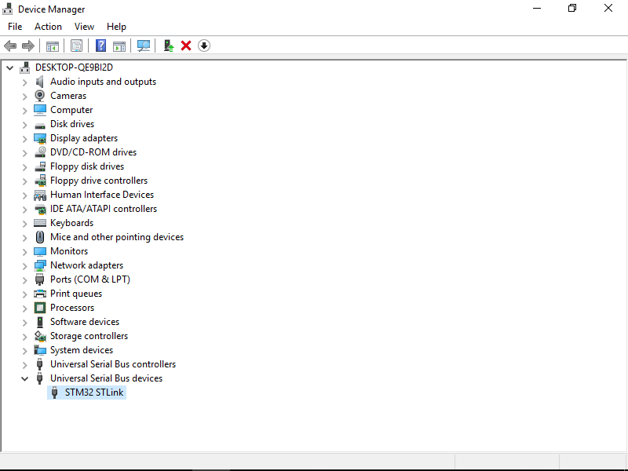

# St-Link

硬件：单片机、淘宝版stlink、4根母头杜邦线

软件：`en.stsw-link009.zip`

# 连线方式

使用杜邦线将单片机与stlink上的对应接口相连（stlink上有十根针，只需要连接其中的4根）

连线方式如下

```
GND     --  GND
TCK     --  SWCLK
TMS     --  SWDIO
3.3V    --  3.3V
```

# 安装驱动

将 `stlink_stsw-link009.zip` 解包后按 `readme.txt` 指示运行即可。

如果 St-Link 成功安装，则将 St-Link 连接电脑后应该被正常识别。如果连接后系统无法识别，且在设备管理器中可以看到黄色叹号的 `STM32 Link`，说明驱动未安装或安装不成功。

# 操作截图

为便于同学安装，以下为安装过程中每一步的截图：

1. 将 `en.stsw-link009.zip` 解包，以**管理员权限**运行 `stlink_winusb_install.bat` 


2. 单击 `Next`


3. Windows 询问是否安装驱动，请放行


4. 安装成功，点击 `Finish` 结束


5. 连接 St-Link 后，设备管理中看到 `STM32 STLink`被正常识别，确认安装成功


